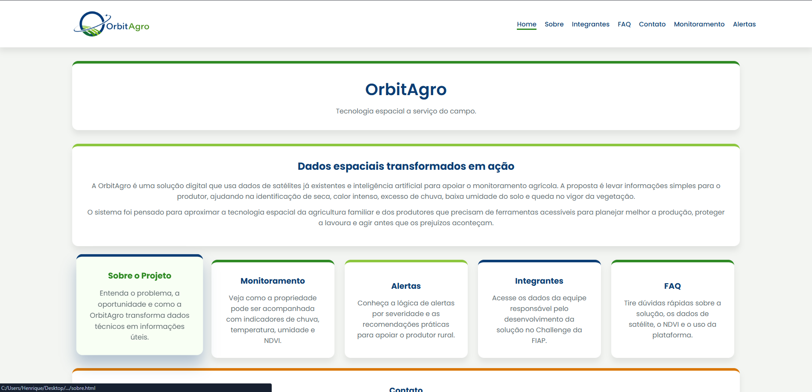
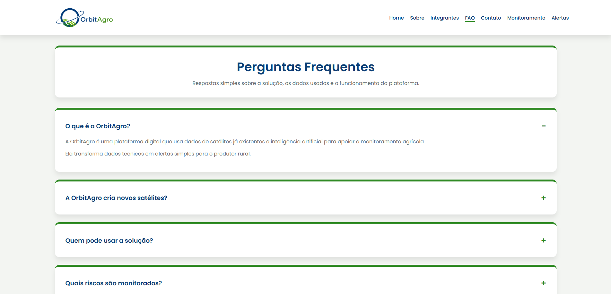
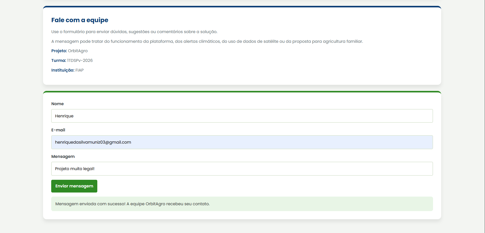

# OrbitAgro

A **OrbitAgro** é uma solução tecnológica desenvolvida para a **Global Solution 2026/1 da FIAP**, com o objetivo de aproximar a tecnologia espacial da agricultura brasileira.
O projeto tem a ideia de usar **dados de satélites já existentes** e inteligência artificial para apoiar o monitoramento agrícola, ajudando produtores rurais a identificar riscos climáticos que podem afetar suas plantações, como seca, excesso de chuva, calor intenso, baixa umidade do solo e queda no vigor da vegetação.

A proposta da OrbitAgro não é criar novos satélites, mas sim aproveitar dados espaciais que já existem e transformar essas informações em alertas simples, visuais e fáceis de entender. Dessa forma, a solução apoia a tomada de decisão no campo, principalmente para a agricultura familiar e produtores rurais que precisam de tecnologia acessível.

---

## Objetivo do Projeto

O objetivo da OrbitAgro é criar uma plataforma digital simples e responsiva, capaz de apresentar informações sobre monitoramento agrícola, alertas climáticos e recomendações práticas para o produtor rural.

O site apresenta a solução, explica seu funcionamento, mostra os integrantes do grupo, possui uma página de contato com validação em JavaScript e páginas dedicadas ao monitoramento e aos alertas da plataforma.

---

## Tecnologias Utilizadas

As tecnologias utilizadas no desenvolvimento do projeto foram:

- **HTML5**  
  Utilizado para estruturar as páginas, seções, formulários, cards, textos e links de navegação.

- **CSS3**  
  Utilizado para aplicar a identidade visual da OrbitAgro, organizar os cards, criar responsividade para desktop, tablet e celular, além de estilizar menus, botões, formulários e rodapé.

- **JavaScript**  
  Utilizado para validar o formulário de contato e simular uma análise simples de risco agrícola com base em umidade do solo, chuva acumulada e temperatura.

---

## Estrutura de Pastas do Projeto

A estrutura do projeto foi organizada da seguinte forma:

OrbitAgro-FrontEnd/
│
├── index.html
├── README.md
│
├── assets/
│   ├── logo-orbitagro.png
│   ├── solo-seco.jpg
│   ├── henrique.jpg
│   ├── erick.jpg
│   ├── joao.jpg
│   └── gustavo.jpg
│
├── css/
│   ├── index.css
│   ├── sobre.css
│   ├── integrantes.css
│   ├── faq.css
│   ├── contato.css
│   ├── monitoramento.css
│   └── alertas.css
│
├── js/
│   └── script.js
│
└── pages/
    ├── sobre.html
    ├── integrantes.html
    ├── faq.html
    ├── contato.html
    ├── monitoramento.html
    └── alertas.html

---

## Páginas do Site

O projeto possui as seguintes páginas:

- **Home**  
  Apresenta a OrbitAgro, sua proposta principal e links para as páginas internas.

- **Sobre**  
  Explica o contexto do problema, a oportunidade identificada e a solução proposta.

- **Integrantes**  
  Mostra os integrantes do grupo, RM, turma, GitHub e LinkedIn.

- **FAQ**  
  Reúne perguntas frequentes sobre o funcionamento da OrbitAgro, uso de satélites, público-alvo e alertas.

- **Contato**  
  Contém um formulário com validação em JavaScript para envio de mensagem.

- **Monitoramento**  
  Apresenta uma simulação de acompanhamento agrícola com indicadores como umidade do solo, chuva acumulada e temperatura.

- **Alertas**  
  Mostra exemplos de alertas climáticos e recomendações práticas para o produtor rural.

---

## Funcionalidades Implementadas

O site possui as seguintes funcionalidades:

- Navegação entre páginas por meio do menu.
- Layout responsivo para desktop, tablet e celular.
- Cards informativos sobre a solução.
- Página de integrantes com dados da equipe.
- Formulário de contato com validação em JavaScript.
- Simulação de risco agrícola com mensagens personalizadas.
- Alertas para dados inválidos, como temperatura incorreta ou umidade do solo acima de 100%.
- Organização visual baseada na identidade da OrbitAgro.

---

## Imagens e Ícones Relacionados ao Projeto
## Prints do Projeto

### Cards interativos da página inicial



Na página inicial, foram adicionados cards interativos que facilitam a navegação entre as principais áreas do site, como Sobre, Monitoramento, Alertas, Integrantes e FAQ.

### Acordeon na página FAQ



A página de perguntas frequentes conta com um acordeon desenvolvido em JavaScript, permitindo abrir e fechar as respostas de forma dinâmica e organizada.

### Validação com JavaScript na página Contato



Na página de contato, o formulário possui validação com JavaScript, exibindo uma mensagem de sucesso quando os campos são preenchidos corretamente.

---

## Link do Repositório

Link público do repositório no GitHub:

```
https://github.com/henriquemunizz/OrbitAgro-FrontEnd

---

## Autores e Créditos

Projeto desenvolvido por:

Henrique da Silva Muniz
RM: 573874
Turma: 1TDSPV-2026
GitHub: https://github.com/henriquemunizz
LinkedIn: https://www.linkedin.com/in/henrique-muniz-044b05365

Erick Keiji Miyashiro
RM: 568966
Turma: 1TDSPV-2026
GitHub: https://share.google/xpS9gpDfEr3WzYZaw
LinkedIn: https://www.linkedin.com/in/erick-keiji-miyashiro-6228b93b4

João Carlos Silva
RM: 568952
Turma: 1TDSPV-2026
GitHub: https://github.com/jocax007
LinkedIn: https://www.linkedin.com/in/joão-carlos-lopes-957976264

Gustavo Costa
RM: 573074
Turma: 1TDSPV-2026
GitHub: https://github.com/gcosta900
LinkedIn: https://www.linkedin.com/in/gustavocostamoreira

---

## Contato

henriquedasilvamuniz03@gmail.com ou rm573874@fiap.com.br ou 11985963197

erickmiyashiro@gmail.com ou rm568966@fiap.com.br ou 11 947970626

guzta.costa@gmail.com ou rm573074@fiap.com.br ou 11913112522

rm568952@fiap.com.br ou 11947289435
---

## Instituição

Projeto desenvolvido por alunos da **FIAP** em dedicação à **Global Solution 2026/1**.

---

## Observação

Este projeto é um protótipo acadêmico de front-end. Algumas funcionalidades, como dados de satélite e análise inteligente, são representadas por simulações para demonstrar o funcionamento da solução proposta.

**Tivemos um problema no GitHub ao tentar abrir o Pull Request, pois duas branchs estavam com o histórico de commits diferente da branch main. O GitHub não permitia comparar as alterações corretamente, aparecendo a mensagem de que não havia nada para comparar entre as branches.

Tentamos resolver sem apagar o histórico, mas não foi possível concluir o processo dessa forma. Por isso, para não comprometer a entrega, criamos uma nova branch e colocamos nela o projeto finalizado, sobrepondo os arquivos com a versão correta.

O projeto final está completo e atualizado nessa nova branch que foi mergeada com a main. A mudança foi feita apenas para corrigir o problema de histórico das branches e permitir a entrega corretamente.**
